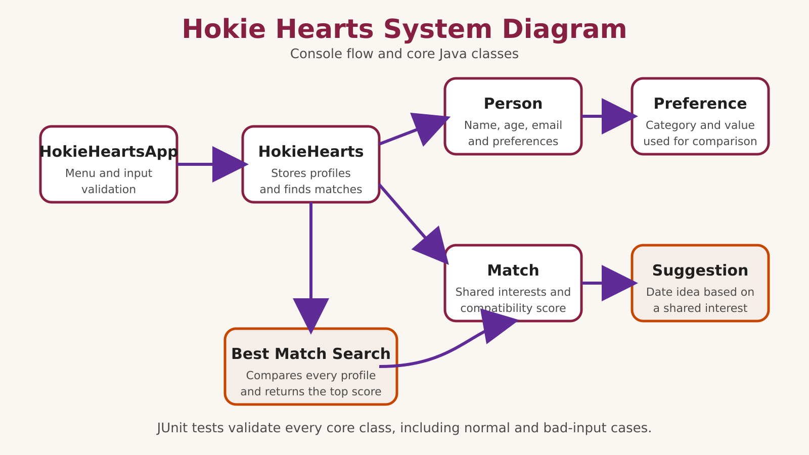

# Hokie Hearts

Hokie Hearts is a console-based Java dating application for Virginia Tech students. Users can create profiles with `@vt.edu` email addresses, add preferences, compare profiles, find their best match, and receive a date suggestion based on shared interests.

## Features

- Create and view student profiles
- Validate Virginia Tech email addresses
- Add interests and preferences to profiles
- Compare two profiles using a compatibility percentage
- Display shared preferences and a suggested date idea
- Find the highest-scoring match, including tied results
- Handle invalid menu choices, ages, emails, names, and missing profiles without crashing

## Compatibility calculation

Compatibility is calculated as:

`shared unique preferences / total unique preferences × 100`

For example, if two profiles share three of their five unique preferences, their compatibility is 60%.

## Stretch goals

The project includes two improvements beyond the basic MVP:

1. **Find My Best Match** searches every stored profile and returns the person or people with the highest compatibility score.
2. **Date Suggestions** recommends an activity using a shared interest. If the match has no shared preferences, the program suggests meeting for coffee on campus.

## Requirements

- Java 17 or later
- Eclipse IDE with the Virginia Tech CS2 Support library for running the provided tests

## Compile and run in Eclipse

1. Clone or download this repository.
2. Open Eclipse and choose **File > Import > Existing Projects into Workspace**.
3. Select the `cs2114-project1-group67` project folder.
4. Confirm that `CS2-Support` appears on the project build path.
5. Open `src/hokiehearts/HokieHeartsApp.java`.
6. Choose **Run As > Java Application**.

## Run the tests

1. In Eclipse, open the `src/hokiehearts` package.
2. Select the test classes ending in `Test.java`.
3. Choose **Run As > JUnit Test**.

The project contains tests for `Person`, `Preference`, `Match`, `HokieHearts`, and `Suggestion`. The completed test suite contains 24 passing unit tests.

## System diagram



## Project structure

```text
src/hokiehearts/
├── HokieHeartsApp.java       Console user interface
├── HokieHearts.java          Profile storage and matching service
├── Person.java               User profile
├── Preference.java           Preference category and value
├── Match.java                Compatibility calculation
├── Suggestion.java           Date suggestion generator
└── *Test.java                JUnit tests
```
